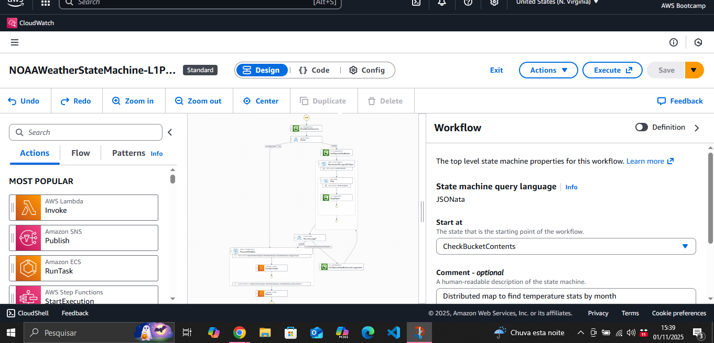

# 🛠️ 01 - Hands-on Prático: Orquestração de Fluxos com AWS Step Functions

## 🚀 O que é AWS Step Functions?

O **AWS Step Functions** é um serviço de orquestração de fluxos de trabalho que permite a você construir aplicativos distribuídos e microserviços, coordenando diversos serviços da AWS em sequências lógicas. Ele atua como um maestro, definindo a ordem das tarefas, adicionando lógica de ramificação (decisões), loops e tratamento de erros, tudo isso de forma visual (low-code/no-code) ou via código (Amazon States Language - ASL). Com Step Functions, você pode gerenciar e monitorar cada etapa do seu fluxo de trabalho de forma clara e eficiente.

---

## 📝 Visão Geral do Desafio

Este primeiro desafio prático focou na introdução e utilização do serviço **AWS Step Functions** para orquestrar um fluxo de trabalho (State Machine) na nuvem.

O objetivo foi entender como criar, executar e monitorar um fluxo automatizado sem a necessidade de escrever código complexo de coordenação, utilizando uma máquina de estados pré-configurada (template).

## 💡 Cenário Executado

Utilizamos um template de máquina de estados pronto da AWS (State Machine) que simulava um fluxo comum de processamento de dados. O fluxo coordenava diversas tarefas, iniciando ou interagindo com um bucket no **Amazon S3** para verificar documentos e processar informações sequencialmente.

**Visualização do Fluxo de Trabalho (State Machine):**
Aqui está o diagrama do fluxo de trabalho (`NOAAWeatherStateMachine`) no console do Step Functions, mostrando a estrutura visual da máquina de estados:

## 🚀 Aprendizados Chave (A Visão Geral para o Recrutador)

* **Orquestração Visual (Low-Code/No-Code):** Compreensão de como o Step Functions permite definir a lógica do fluxo de trabalho por meio de um designer visual, utilizando a **Amazon States Language (ASL)** nos bastidores.
* **Máquinas de Estados (State Machines):** Entendimento da estrutura de estados (Task, Choice, Wait, Parallel, Succeed, Fail) para definir a lógica de aplicação.
* **Monitoramento Integrado:** Exploração do painel de execução para acompanhar o fluxo em tempo real.
    * **Visualização Gráfica:** Capacidade de ver o caminho percorrido (o que foi executado e o que foi pulado).
    * **Logs e Eventos:** Uso dos eventos e logs (integrados, por exemplo, com o **Amazon CloudWatch**) para depurar a execução e verificar os dados de entrada/saída de cada etapa.
* **Serviços Integrados:** Reconhecimento da capacidade do Step Functions de integrar e coordenar diversos serviços da AWS, como S3, Lambda e outros.

## ⚙️ Tecnologias Utilizadas

* **AWS Step Functions:** Serviço principal de orquestração.
* **Amazon S3:** Serviço de armazenamento (ponto de partida do fluxo).
* **Amazon CloudWatch:** Utilizado para monitoramento e visualização de logs/eventos gerados pela execução

---

