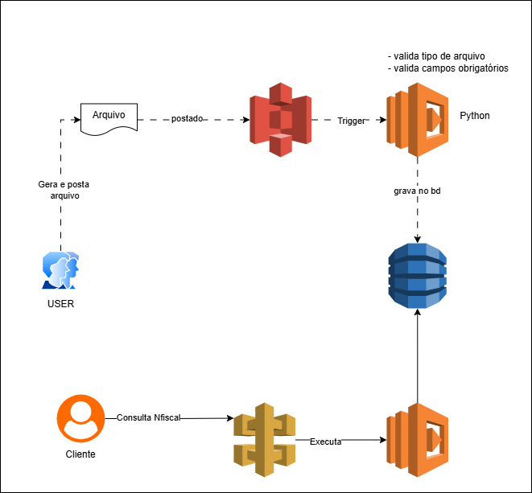

# ☁️ 05 - Serverless: Processamento Assíncrono de Arquivos com Lambda, S3 e DynamoDB

## 📝 Visão Geral do Desafio

O Desafio 05 focou na implementação de uma arquitetura **Serverless Orientada a Eventos** para processar automaticamente o upload de arquivos. O objetivo foi orquestrar serviços Serverless da AWS (S3, Lambda e DynamoDB) para criar um fluxo de trabalho assíncrono, eficiente e escalável.

Uma parte fundamental do desafio foi a utilização do **LocalStack**, permitindo desenvolver, testar e configurar os recursos da AWS localmente antes de migrar para a nuvem.

## 🚀 Arquitetura Serverless Implementada

A infraestrutura Serverless implementada segue o padrão de processamento de dados e consultas via API. O diagrama abaixo ilustra o fluxo de ponta a ponta:

**Diagrama de Arquitetura do Processamento de Arquivos:**

### Fluxo Detalhado da Solução:

1.  **Geração e Postagem do Arquivo:** O **USER** gera e faz o upload de um arquivo de exemplo (CSV ou JSON) para um *Bucket* no **Amazon S3**.
2.  **Evento/Trigger:** O S3, ao detectar o novo arquivo, dispara um evento (*Trigger*).
3.  **Processamento (AWS Lambda 1):** O evento do S3 invoca a primeira **AWS Lambda Function** (escrita em **Python**). Esta função executa a lógica de negócio:
    * Valida o tipo do arquivo.
    * Valida a existência de campos obrigatórios.
    * Extrai as informações e as formata.
4.  **Persistência (DynamoDB):** A função Lambda persiste os dados limpos e validados em uma tabela no **Amazon DynamoDB** (banco de dados NoSQL).
5.  **Consulta (API Gateway & Lambda 2):** O cliente final (**Cliente**) consulta os dados gravados por meio de um *endpoint* exposto pelo **Amazon API Gateway** (Serviço de NFiscal na arquitetura), que por sua vez:
    * Dispara uma segunda **AWS Lambda Function** (Função de Consulta).
    * Esta função de Consulta acessa e retorna os dados armazenados na tabela do DynamoDB.

## 🛠️ Destaques da Implementação

### 1. Ambiente de Desenvolvimento Local (DevOps)
* **LocalStack:** Utilizado para simular o ambiente AWS (S3, Lambda, DynamoDB, etc.) localmente. Isso permitiu a criação e o teste dos recursos e do código da função **gratuitamente** e sem latência, replicando as APIs da AWS de forma eficaz.

### 2. AWS S3 (Amazon Simple Storage Service)
* **Conceito:** Armazenamento de objetos, base para o *data lake*.
* **Uso na Automação:** Agiu como a **fonte de eventos** (Event Source), desacoplando a ingestão do arquivo do seu processamento.

### 3. AWS Lambda
* **Conceito:** Computação *Serverless* sob demanda.
* **Uso na Automação:**
    * Primeira função: **Processamento e Validação** (lógica de ETL).
    * Segunda função: **Consulta** (expondo dados para a API).

### 4. DynamoDB (Amazon DynamoDB)
* **Conceito:** Banco de dados NoSQL rápido e flexível, ideal para workloads Serverless.
* **Uso na Automação:** Persistência dos dados processados, oferecendo baixa latência para a camada de consulta.

## 💡 Benefícios da Automação

| Benefício | Descrição |
| :--- | :--- |
| **Escalabilidade Automática** | O Lambda e o DynamoDB escalam para atender qualquer volume de arquivos ou consultas, sem intervenção manual. |
| **Baixo Custo** | Modelo de pagamento por uso (*Pay-per-use*): você só paga pelo tempo de execução do Lambda e pelo armazenamento/consulta de dados. |
| **Processamento Assíncrono** | O upload do arquivo não depende do tempo de processamento. A Lambda trabalha em segundo plano, garantindo alta disponibilidade na ingestão. |
| **Foco no Código** | Desenvolvimento focado na lógica de validação/gravação (Python), sem gerenciar servidores, sistemas operacionais ou balanceadores.